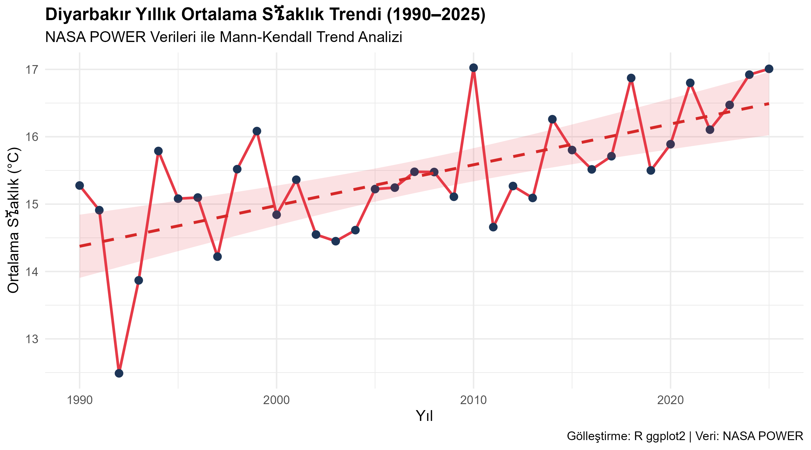
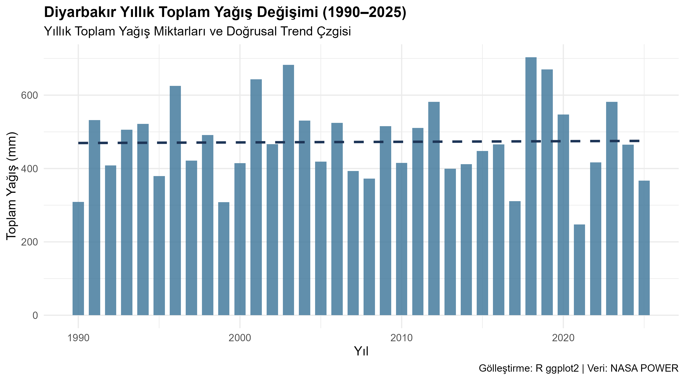

# Diyarbakir Climate Trend Analysis

Climate trend analysis of Diyarbakir, Türkiye using NASA POWER data and R.

## Objective

This project investigates temporal changes in temperature and precipitation in Diyarbakir using climate data and statistical analysis.

## Study Period

1990–2025

## Study Area

Diyarbakir, Türkiye

## Data Source

NASA POWER

## Software

R

## Methods

- Descriptive statistics
- Mann-Kendall trend test
- Sen's slope estimator
- Temperature anomalies
- Precipitation anomalies

## Results

### Temperature Trend

### Precipitation Trend

## Project Structure

- `01_data_download.R` — Data acquisition
- `diyarbakir_climate_analysis.R` — Climate trend analysis
- `diyarbakir_temp_trend.png` — Temperature trend figure
- `diyarbakir_precip_trend.png` — Precipitation trend figure

## Author

Ahmet Solmaz
